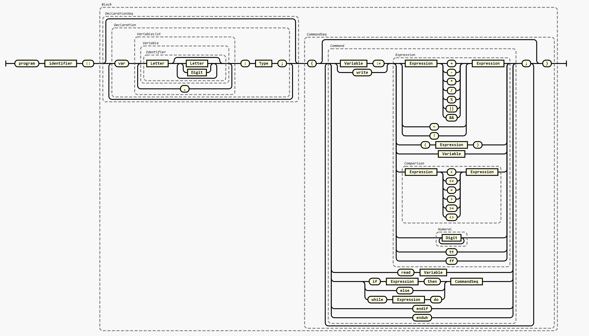

# COL 226: Programming Languages

## Design and Implementation Decisions
Since the given EBNF has reduce reduce conflicts, for a) bool exp and int exp , b) negation of a number, and having a + sign in front of a number/expresion become ambigous . Along with it, since we need to support expressions like tt < ff, we need to modify the language The concept of having bool exp,bool factor, int exp etc have all been changed to one single "expression". To check the validity of a statement, I have implemented a type checker. It essentially keeps a list of tuple of (variable name, type) and makes sure that when a binary operation or unary operation is done on an expression then that is correct type. Eg if we have Expression + Expression, where one is of integer type and other a bool, this throws an error.

For the negation problem, an expn like ~5 could have been read as negation of expression, or as an expression, as a numral can be made to negation 5. For this conflict I have chenged the rule from 
    Numeral=[ + | ~ ]Digit,{Digit} to Numeral=Digit,{Digit}
The rule negation of expression takes care of this problem and for expressions like +5, we add a rule exp -> PLUS NUMBER
as something like 5 + +5 is a valid operation

To make sure precedence is followed, that the grammar given specifies, we use the Yacc's feature of specifying precedence. 

## Running the code

To parse and create an AST file run 
    
    make
    parseFile "filename";
    

To parse and create an AST file without type checking run 

    make
    parseFileNTC "filename";
    


## Context Free Grammar

Below is the EBNF of the grammar I implement as EBNF

```
Program="program", identifier, "::", Block;
Block=DeclarationSeq, CommandSeq;
DeclarationSeq={Declaration};
Declaration="var", VariableList, ":",Type,";";
Type = "int"|"bool";
VariableList = Variable, {",", Variable};
CommandSeq="{",{CMD,";"},"}" ;

CMD=
    Variable,":=",Expression|
    Variable,":=","+",Expression|
    "read", Variable|
    "write", Expression|
    "write","+", Expression|
    "if", Expression, "then", CommandSeq "else", CommandSeq "endif"|
    "while", Expression, "do", CommandSeq "endwh" ;

Expression=
    Expression, "+", Expression|
    Expression, "-", Expression|
    Expression, "*", Expression|
    Expression, "/", Expression|
    Expression, "%", Expression|
    "~", Expression |
    Expression, "||", Expression| 
    Expression, "&&", Expression| 
    "(",Expression, ")"|
    "!",Expression|
    Variable|
    Comparison|
    Numeral|
    + Numeral|
    "tt"|
    "ff"|
    
    Expression, "+", "+",  Expression|
    Expression, "-","+",  Expression|
    Expression, "*","+",  Expression|
    Expression, "/", "+", Expression|
    Expression, "%","+",  Expression|
    "~","+",  Expression |
    "(","+", Expression, ")"|


Comparison=
    Expression, "<",  Expression|
    Expression, "<=", Expression|
    Expression, "=",  Expression|
    Expression, ">",  Expression|
    Expression, ">=", Expression|
    Expression, "<>", Expression|
    Expression, "<", "+", Expression|
    Expression, "<=","+", Expression|
    Expression, "=", "+", Expression|
    Expression, ">", "+", Expression|
    Expression, ">=","+", Expression|
    Expression, "<>","+", Expression;

Variable = Identifier;
Identifier=Letter,{Letter|Digit} ;
Numeral=Digit,{Digit} ;
Character=Letter|Digit;
Letter=UpperCase|LowerCase;

UpperCase="A"|"B"|"C"|"D"|"E"|"F"|"G"|"H"|
"I"|"J"|"K"|"L"|"M"|"N"|"O"|"P"|"Q"|
"R"|"S"|"T"|"U"|"V "|"W"|"X"|"Y "|"Z";
LowerCase="a"|"b"|"c"|"d"|"e"|"f"|"g"|"h"|
"i"|"j"|"k"|"l"|"m"|"n"|"o"|"p"|"q"|
"r"|"s"|"t"|"u"|"v"|"w"|"x"|"y"|"z";
Digit="0"|"1"|"2"|"3"|"4"|"5"|"6"|"7"|"8"|"9";
```

## Railroad


## AST datatype definition
 
```
datatype PROG = PROG of string*(DEC list)*(CMD list)
and      DEC = DEC of (string list)*dtypes
and      dtypes = INT|BOOL
and      CMD = SET of string*Exp
                  |READ of string
                  |WRITE of Exp
                  |ITE of Exp*(CMD list)*(CMD list)
                  |WH of Exp*(CMD list)
and      Exp =  LT of Exp*Exp|
                LEQ of Exp*Exp|
                EQ of Exp*Exp|
                GT of Exp*Exp|
                GEQ of Exp*Exp|
                NEQ of Exp*Exp|
                NOT of Exp|
                AND of Exp*Exp|
                OR of Exp*Exp|
                PLUS of Exp*Exp|
                MINUS of Exp*Exp|
                TIMES of Exp*Exp|
                DIV of Exp*Exp|
                MOD of Exp*Exp|
                NEG of Exp|
                NUM of int|
                BOOLEAN of bool|
                VAR of string
```
## Semantic directed translations

| Production  |    Semantic rule |
|  :----:     |    :----:   |
| Program -> "program" identifier "::" [list of declatrations] [list of commands] | (list of commands).variables := (list of declatrations).variables <br> variables.type = (list of (list of variables).type) <br> variables.value = (list of commands).execution |
| decleration -> VAR [list of variables] COLON Type DELIM | (list of variables).type := Type.type |
| Type -> int  | Type.type := int.int |
| Type -> bool |  Type.type := bool.bool |
|(list of commands)<sub>0</sub> -> LCURL (list of commands)<sub>1</sub> RCURL | (list of commands)<sub>0</sub>.attr := (list of commands)<sub>1</sub>.attr |
| command -> IDENTIFIER ASSN expression| IDENTIFIER.val := expression.val |
| command -> READ IDENTIFIER | IDENTIFIER.val := input.val |
| command -> WRITE expression | output := expression.val |
| command ->IF expression THEN command_seq ELSE command_seq ENDIF | variables.value := command_seq1.execute if expression.val = true else command_seq2.execute |
| command ->WHILE expression DO command_seq ENDWH | while expression.val = true, variables.value := command.execute |
| expression<sub>0</sub> -> expression<sub>1</sub> LT expression<sub>2</sub> | expression<sub>0</sub>.val := tt if expression<sub>1</sub>.val < expression<sub>2</sub>.val else false  |
| expression<sub>0</sub> -> expression<sub>1</sub> LEQ expression<sub>2</sub> | expression<sub>0</sub>.val := tt if expression<sub>1</sub>.val <= expression<sub>2</sub>.val else false  |
| expression<sub>0</sub> -> expression<sub>1</sub> EQ expression<sub>2</sub> | expression<sub>0</sub>.val := tt if expression<sub>1</sub>.val = expression<sub>2</sub>.val else false  |
| expression<sub>0</sub> -> expression<sub>1</sub> GT expression<sub>2</sub>  | expression<sub>0</sub>.val := tt if expression<sub>1</sub>.val > expression<sub>2</sub>.val else false  |
| expression<sub>0</sub> -> expression<sub>1</sub> GEQ expression<sub>2</sub>  | expression<sub>0</sub>.val := tt if expression<sub>1</sub>.val >= expression<sub>2</sub>.val else false  |
| expression<sub>0</sub> -> expression<sub>1</sub> NEQ expression<sub>2</sub> | expression<sub>0</sub>.val := tt if expression<sub>1</sub>.val <> expression<sub>2</sub>.val else false  |
| expression<sub>0</sub> -> expression<sub>1</sub> AND expression<sub>2</sub>  | expression<sub>0</sub>.val := expression<sub>1</sub>.val &&expression<sub>2</sub>.val |
| expression<sub>0</sub> -> expression<sub>1</sub> OR expression<sub>2</sub>  | expression<sub>0</sub>.val := expression<sub>1</sub>.val ||expression<sub>2</sub>.val |
| expression<sub>0</sub> -> expression<sub>1</sub> PLUS expression<sub>2</sub> | expression<sub>0</sub>.val := expression<sub>1</sub>.val + expression<sub>2</sub>.val |
| expression<sub>0</sub> -> expression<sub>1</sub> MINUS expression<sub>2</sub>  | expression<sub>0</sub>.val := expression<sub>1</sub>.val - expression<sub>2</sub>.val |
| expression<sub>0</sub> -> expression<sub>1</sub> TIMES expression<sub>2</sub> | expression<sub>0</sub>.val := expression<sub>1</sub>.val * expression<sub>2</sub>.val |
| expression<sub>0</sub> -> expression<sub>1</sub> DIV expression<sub>2</sub>  | expression<sub>0</sub>.val := expression<sub>1</sub>.val / expression<sub>2</sub>.val |
| expression<sub>0</sub> -> expression<sub>1</sub> MOD expression<sub>2</sub>  >| expression<sub>0</sub>.val := expression<sub>1</sub>.val % expression<sub>2</sub>.val |
| expression<sub>0</sub> -> LPAREN expression<sub>1</sub> RPAREN  | expression<sub>0</sub>.val := expression<sub>1</sub>.val |
| expression<sub>0</sub> -> NOT expression<sub>1</sub>  | expression<sub>0</sub>.val := ! expression<sub>1</sub>.val |
| expression<sub>0</sub> -> NEG expression<sub>1</sub>| expression<sub>0</sub>.val := -1* expression<sub>1</sub>.val |
| expression -> BTRUE  | expression.val := true |
| expression -> BFALSE  | expression.val := false |
| expression -> NUMBER  | expression.val := NUMBER.val |
| expression -> PLUS NUMBER  | expression.val := NUMBER.val |
| expression -> IDENTIFIER  | expression.val := IDENTIFIER.val |


## Test Code
### While code
```
    program chad :: 

    var a,b,c : int ;var d,e,f : bool;
    {   
        b := 0;
        while  b <> 5 do { write b; b := b + 1;} endwh;
    }
```
### AST OutpuT
```
val it =
 PROG
    ("chad",[DEC (["a","b","c"],INT),DEC (["d","e","f"],BOOL)],
     [SET ("b",NUM 0),
      WH
        (NEQ (VAR "b",NUM 5),[WRITE (VAR "b"),SET ("b",PLUS (VAR "b",NUM 1))])])
  : WhileParser.result
```


## Acknowledgements

While no code has been copied from any source as such, to learn about ml-yacc and ml-lex, I followed 2 pdfs, and a lot of my design choices have been influenced by their examples. The 2 pdfs were [Pdf from profs Website](http://rogerprice.org/ug/ug.pdf) and [This pdf on ml-yacc](http://cs.wellesley.edu/~cs235/fall08/lectures/35_YACC_revised.pdf). For the glue code that is whileinterface.sml and for loading sml in ```load-while.sml``` I took how to write the syntax from the second pdf. Nothing was blindly copy pasted though. To convert my ebnf to railroad, I used this [website](https://matthijsgroen.github.io/ebnf2railroad/)